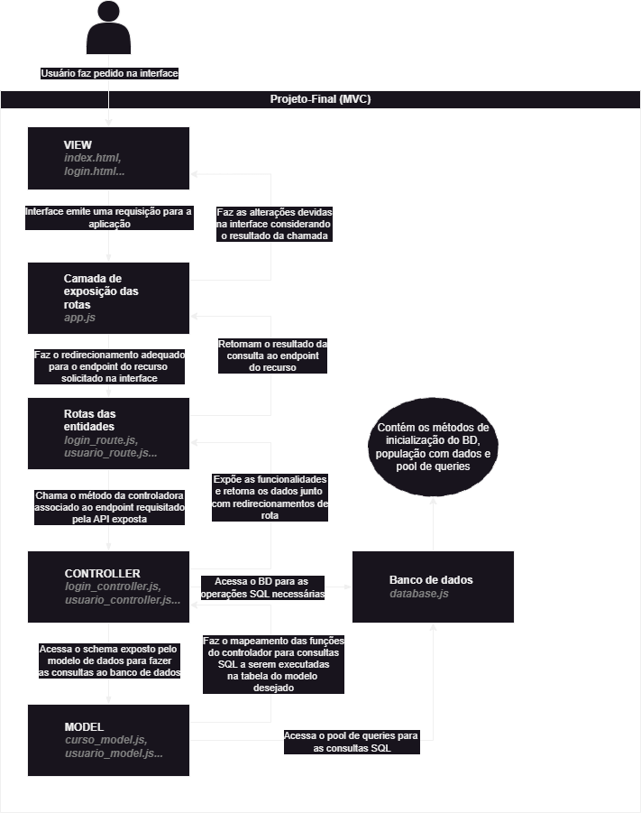

An application dedicated to enhance the experience of students and employess at UnB when it comes to internal services requests and provisioning.
# Project Structure:
The project is an implementation of the MVC architectural pattern, designed to optimize the communication of the client-side requisitions with the database models defined. As such, the file structure is divided in:

## Config:
The configuration of the database on itself, considering its creation, population and exporting for other application components. It is also important to note that the **process.env** is used for parametrization.
## Models:
The files containing the translation of the SQL-defined entities and the operations to be performed on them by the user.
## Controllers:
The files responsible for implementing the communication between the model data and the application requests. In other words, implements the business logic for the application.
## Routes:
The files responsible for mapping the operations defined in the controller layer to URL endpoints to be used in the application, considering the different HTTP Methods supported and their formats.
## Public:
Contains the files necessary for the interface implementation and responsiveness through JavaScript functions. These components will use the procedures implemented in the previous components to provide all the functionalities for the user through a visual representation. As such, it implements the "View" layer of the MVC pattern.
In addition, it also includes some source images used, as well as the **"functions"** folder, which contains the .js files to be used for HTML manipulation.

# Setup / initialization:
Before running the application, make sure that you install the dependencies by going into the root folder and running:
```
npm install
npm i mysql2 --save
npm i express --save
npm i express-session
npm i multer
```
After that, make sure that MySQL is up and running by running the following command in Windows PowerShell as administrator, replacing the bracketed part with the proper path for the mysql executable:
```
& C:\[path_to_MySQL_folder]\MySQL\MySQL Server 8.0\bin\mysqld
```
With that, you may initialize the database and then run the project by executing (in the root of the application):
```
npm start
```
